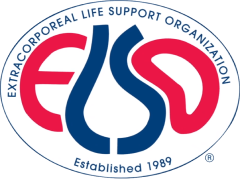

<p align="center">
  
</p>

## 📱 ELSO Bedside Mobile Application

The **ELSO Bedside Mobile Application** is a streamlined, easy-to-use digital handbook built for clinicians working with **Extracorporeal Life Support (ECLS)** systems. Designed specifically for bedside use, it provides quick access to essential clinical content, including:

https://elso.sweetrush.net/

- 🛠️ **Equipment reference guides**
- 💊 **Medication information**
- 🧪 **Real-life ECLS scenarios**
- ✅ **Checklists and protocols for device usage**
- 🔗 **Resource links for best practices and references**
- 🧮 **Clinical calculators for quick decision support**

This app is built using the **Ionic Framework**, **Capacitor**, and **AppFlow** for efficient cross-platform development and secure mobile distribution.

> ⚠️ **Note:** The app will be available on **iOS** and **Android** only.  
> ⚠️ **Developer Note:** Please use `pnpm` — **do not** use `npm` when installing or managing dependencies.

---

## ⚙️ Project & Deployment Notes

> ⚠️ **Notice:** AppFlow will be deprecated in **December 2027**.  
> 👉 **Alternative:** [CapAwesome Cloud](https://cloud.capawesome.io/#pricing)

### 📦 App IDs & Distributions

One repo builds for every store account. Each distribution is a
`capacitor.config.<name>.json` at the project root, and `CAPACITOR_CONFIG`
picks the one to build:

| Profile     | App ID                       | Accounts                     |
| ----------- | ---------------------------- | ---------------------------- |
| `sweetrush` | `com.sweetrush.staging.elso` | SweetRush internal (staging) |
| `elso`      | `com.ecmo.bedside`           | ELSO client                  |

```powershell
npm run config_list            # list profiles, * marks the applied one
$env:CAPACITOR_CONFIG='elso'   # then build/sync as usual
npm run build
```

```bash
CAPACITOR_CONFIG=elso npm run build     # macOS / CI / AppFlow
node app.config.js elso                 # switch without building
node app.config.js elso --dry-run       # show what would change
```

`npm run build`, `sync`, `android_run` and `android_open` all run
`app.config.js` first. It copies the selected profile over
`capacitor.config.json` and writes the identity into the native projects:

- `android/app/build.gradle` — `applicationId`
- `android/app/src/main/res/values/strings.xml` — app name, package, URL scheme
- `ios/App/App.xcodeproj/project.pbxproj` — `PRODUCT_BUNDLE_IDENTIFIER`
- `ios/App/App/Info.plist` — `CFBundleDisplayName`

It also runs on `postinstall`, so an AppFlow build picks up the profile from
`npm install` onward even if the build script is ever reconfigured.

With `CAPACITOR_CONFIG` unset it re-applies the `capacitor.config.json` already
in place, so a plain build never switches distribution behind your back.
Commit whichever profile is applied — that is the repo default.

**In AppFlow, set `CAPACITOR_CONFIG` in the app's environment and nothing else.**
The native project files are rewritten inside the throwaway build checkout,
before gradle/xcodebuild read them — those edits are never committed and are
discarded with the container. Both AppFlow apps build from this one repo and
branch; only the env var differs.

The gradle `namespace` and the `MainActivity` java package deliberately stay
`com.sweetrush.staging.elso` for every profile. Only `applicationId` decides
store identity, so nothing has to move on disk when the profile changes.

> ⚠️ Run `npm run update_version` (version + build number) **before**
> `npm run build` — both scripts write to the native projects.

#### Adding a distribution

Copy an existing profile to `capacitor.config.<name>.json` and edit it:

```json
{
  "appId": "com.sweetrush.elso",
  "appName": "ECMO Bedside Guide",
  "webDir": "dist",
  "distribution": {
    "name": "production",
    "label": "SweetRush production",
    "displayName": "Bedside Guide",
    "showDebug": false
  }
}
```

`displayName` is the home-screen name; `androidDisplayName` / `iosDisplayName`
override it per platform. `showDebug` drives `import.meta.env.SHOW_DEBUG` (the
in-app debug panel), and `name` is exposed as `import.meta.env.DISTRIBUTION`.

---

## 🐳 Docker

```bash
docker build -t elso-app --no-cache .
# or 
docker buildx build -t elso-app --no-cache .
# then
docker run -it -p 8080:8080 --rm --name elso-app-production elso-app
# or run dev.sh script
```

---

## 🧪 Development Build

> ⚠️ **Note:** For development, please use `pnpm` — **do not** use `npm`.  
> `npm` is acceptable in general, but `pnpm` should be used for all Ionic Capacitor-related packages and commands.

### Start Local Dev Server

```bash
pnpm install
pnpm start
```

➡️ Open: [http://localhost:3005/](http://localhost:3005/)

### Production Build

```bash
pnpm run build
```

---

## 🧾 JSON Data Link Example

```html
<a href='#' data-link='CHECKLIST##ELSOBA_CHKLST_160' target='_self'>Membrane Lung Failure checklist</a>
```

---

## 🚀 Deployment & App Flow

🔗 [Ionic AppFlow Dashboard](https://ionic.io/appflow)

### 📱 Generate iOS Project

```bash
npx cap add ios
```

This is a portrait only app. To enfore ```UIInterfaceOrientationPortrait``` mode, add the following to the iOS `.plist`:

```xml
<key>ITSAppUsesNonExemptEncryption</key>
<false/>
<key>UISupportedInterfaceOrientations</key>
<array>
  <string>UIInterfaceOrientationPortrait</string>
</array>
```

### 🤖 Generate Android Project

```bash
npx cap add android
```

### 🔢 Generate New Build Number

The **Build Version Number** is used for iOS/Android minor updates.  
The **Project Version** should be updated for major changes.

```bash
pnpm run build_version
```

---

## 🚚 App Distribution (App Flow)

1. Select target: **iOS** or **Android**  
2. Set Build Type: **Development**  
3. Add necessary **environment variables**  
4. Press **Build** — if configured, AppFlow will deliver the build via **TestFlight** or **APK**

---

## 🖼️ Generate Icons

Reference: [Capacitor Icon Guide](https://capacitorjs.com/docs/guides/splash-screens-and-icons)

```bash
npm install @capacitor/assets --save-dev
npx capacitor-assets generate
```

---

## ✂️ Crop SVGs

- [https://svgcrop.com/](https://svgcrop.com/)

---

## 📤 Distribution Sites

- [https://www.diawi.com/](https://www.diawi.com/)

---

## 🍎 iOS Development

### 🖥️ Build & run iOS from Windows (network Mac)

The Mac on the LAN can be driven over ssh from Windows — no need to sit at it, and no
AppFlow round trip for simulator testing. See [`tools/mac/README.md`](tools/mac/README.md).

```powershell
cd tools\mac
.\Mac-Doctor.ps1     # check both machines
.\Mac-Setup.ps1      # first run only
.\Mac-Run-iOS.ps1    # build + launch in the Mac's iOS Simulator
.\Mac-Run-iOS.ps1 -Live   # hot reload from the local vite dev server
```

Or via npm: `npm run ios_run`, `npm run ios_live`, `npm run ios_logs`, `npm run ios_doctor`.

Simulator builds only — device builds and TestFlight remain on AppFlow.

### 🔐 Renew Distribution/Dev Certificate

1. Open **Keychain Access** → `Certificate Assistant > Request a Certificate from a Certificate Authority`
2. Save the `.certSigningRequest` (CSR) file
3. Upload CSR to [Apple Developer Portal](https://developer.apple.com)
4. Download and install the `.cer` file
5. Update **Provisioning Profiles**
6. Update certificates in **AppFlow** under *Signing Certificates*
7. Rebuild and distribute the app

---

## 🤖 Android Development

### View Android Logs

```bash
{ANDROID_SDK_PATH}/adb.exe logcat
```

---

## 📚 References

- **Ionic App Flow Dashboard**  
  https://dashboard.ionicframework.com/org/4df82aa8-703e-4243-a310-fc777fe36d7f/apps

- **Figma Designs**  
  https://www.figma.com/files/865628658352013984/project/238209524?fuid=644590515443336826

- **Storyboard (Google Docs)**  
  https://docs.google.com/document/d/1llzINFw2NHGoEf25QA0KM-MRJGlXlmR854kZv7vt5cc/edit?tab=t.0

